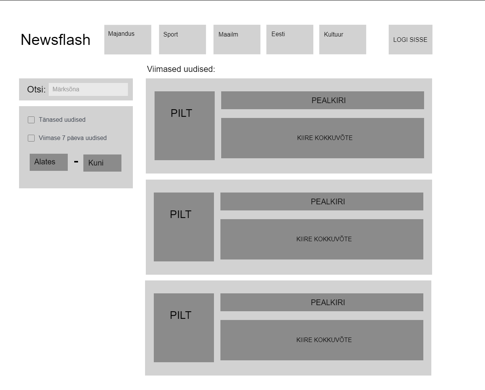
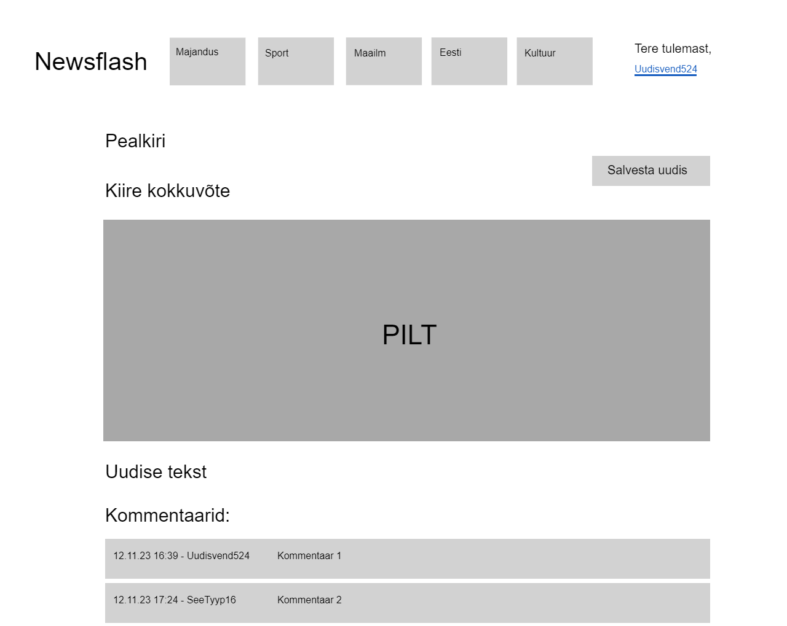
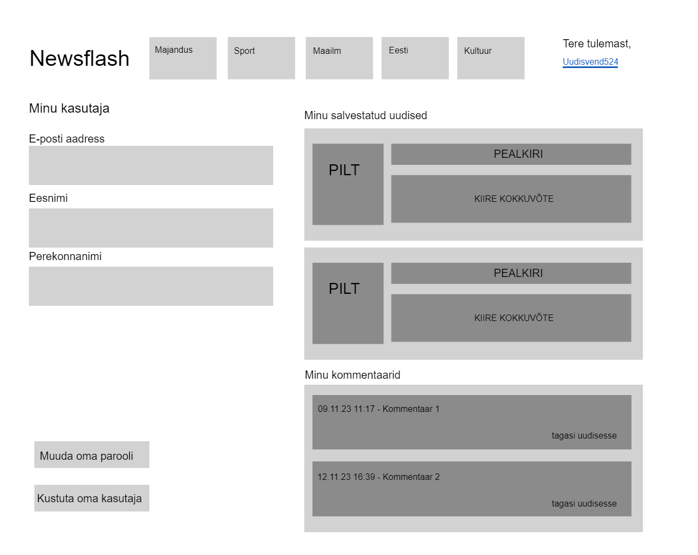

# Projekti nimi

NewsFlash

# Projekti liikmed

- Kevin-Kaspar Einsok
- Sten-Kristjan Prantsu
- Henry Pajuri

# Projekti kirjeldus

Projekti eesmärgiks on luua keskne portaal uudiste lugemiseks. Fetchime uudised erinevatest uudiste sitedelt (delfi, õhtuleht, postimees jne) ja kuvame need ühes kohas. Uudiseid saab filtreerida ning need filtrid on nii kategoorilised (majandus, riik, sport jne) kui ka ajalised (last day, last 7 days vms). Sisseloginud kasutaja saab uudised salvestada oma arhiivi ning samas jätta ka uudistele oma kommentaar, mida näevad kõik teised sisseloginud kasutajad.

# Projekti funktsionaalsused

- Hilisemate uudiste kuvamine pealehel
- Külastajad saavad ennast kasutajaks registreerida ja sisse logida
- Sisseloginud kasutajad saavad uudiste alla kommenteerida
- Uudised on kategoriseeritud valdkondade järgi
- Uudiseid saab endale arhiivi salvestada
- Uudiseid saab ka ajaliste filtrite kaudu otsida

# Projekti wireframe

## Avaleht

## Uudis

## Minu profiil

